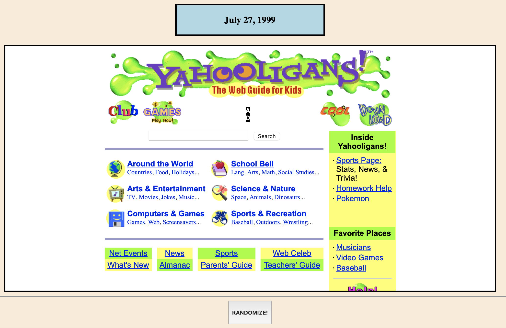

# THE YAHOOLINATOR! - Randomized Yahooligans Wayback Page

---

Sometimes I like to browse random websites on the wayback machine on my spare time and I have realized that going through archives of the Yahooligans website is a really good way to find some interesting hidden gems on the Wayback Machine without have to search for anything specific. Knowing this is what gave me the idea to make this project. It took me a few days to make.

What this project does is show you a random Wayback Machine capture of the Yahooligans website from 1998 to 2006 everytime you click the "Randomize!" Button. You can also open up the page with the "Open In A New Tab" Button.

